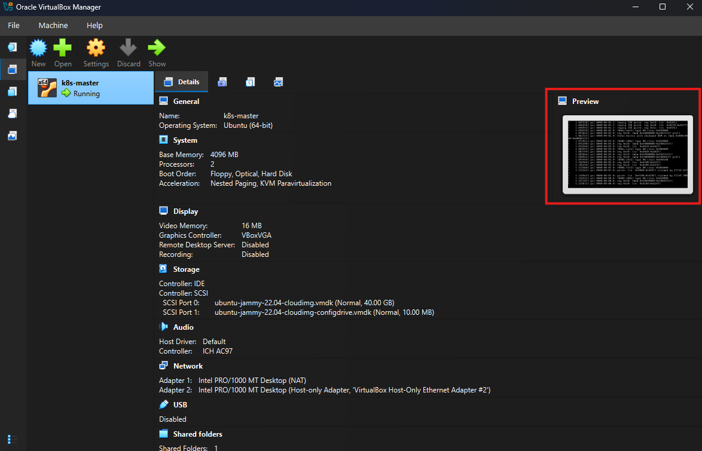
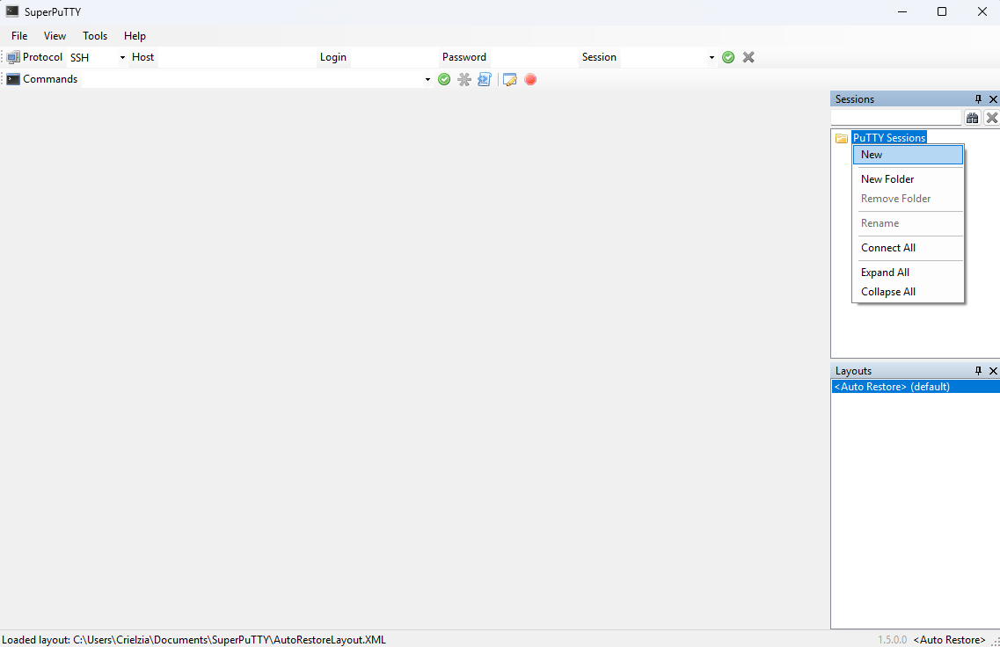
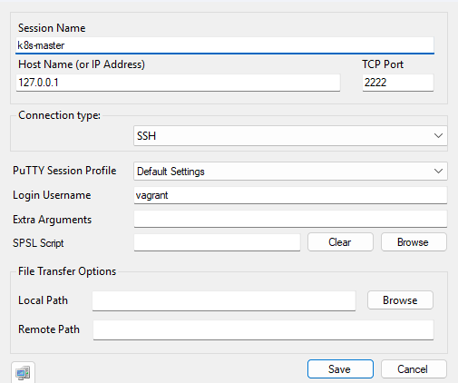

# Kubernetes playground

Greetings and welcome to my humble teaching project.

This project's purpose is to help you install your very own Kubernetes cluster.

It is designed to give you the easiest possible way to spin up a real Kubernetes cluster (not Minikube or something that installs in one command and gives no explanations).

This project is paired with my Udemy course (currently a work in progress).

Together with the course, this project will teach you Kubernetes in a very in-depth and easy-to-follow way.

By the end, you will understand what everything does intuitively, not just "install this, do that" :)

---

# Table of Contents

- [Prerequisites](#prerequisites)
  - [Visual Studio Code](#visual-studio-code)
  - [Git](#git)
  - [VirtualBox](#virtualbox)
  - [Vagrant](#vagrant)
  - [PuTTY](#putty)
  - [WinSCP](#winscp)
  - [SuperPuTTY](#superputty)
  - [SSH Keys](#ssh-keys)
- [Quick Start](#quick-start)
  - [Bringing the VMs to Life](#bringing-the-vms-to-life)
  - [Pausing the VMs](#pausing-the-vms)
  - [Deleting the VMs](#deleting-the-vms)
  - [Connecting to the Machines](#connecting-to-the-machines)
    - [Importing the Private Key](#importing-the-private-key)
    - [Importing or Creating the Connections in SuperPuTTY](#importing-or-creating-the-connections-in-superputty)
    - [Actually Connecting to the Machines](#actually-connecting-to-the-machines)
    - [Extra Info About SuperPuTTY](#extra-info-about-superputty)
- [Lessons](#lessons)

# Prerequisites

## Visual Studio Code

It's optional, however, I highly recommend having this, it's a useful editor for all sorts of code. Definitely useful in DevOps where you often deal with many different types of files working together :)

Download and install from:
```
https://code.visualstudio.com/download
```

## Git

Download and install Git from:

```
https://git-scm.com/install/windows
```

In the screen where it asks you what editor to use, pick **Visual Studio Code**.

It is also **VERY IMPORTANT** that you set **Checkout as-is, commit as-is** when it gets to the "Configuring line ending conversions" step. This ensures that, when your git downloads a .sh script meant for Linux, it will not replace its line endings (a hidden character that signifies a newline) with a Windows-specific one. This can cause the Linux script to fail.

More info here on the topic: https://www.cs.toronto.edu/~krueger/csc209h/tut/line-endings.html#:~:text=Text%20files%20created%20on%20DOS/Windows%20machines%20have,sure%20the%20line%20endings%20are%20translated%20properly.

The rest is a matter of next -> next -> install -> finish.

You might already have this, you need it to clone the project :)

In case you don't and you don't know what that means, to clone the project using Git, open a PowerShell in the folder where you want this project and run:

```
git clone https://github.com/mihai-scornea/kubernetes-playground.git
```

## VirtualBox

VirtualBox is a hypervisor, a program used to simulate hardware and run virtual machines. We will use this to create virtual computers that we will treat as computers sitting somewhere in a room, on which we will install our Kubernetes cluster.

Download and install from:
```
https://www.virtualbox.org/wiki/Downloads
```

## Vagrant

Vagrant is a utility program that can tell VirtualBox what to do for us.

Vagrant can read a special file called a Vagrantfile in which we can describe exactly what virtual machines we want. Very helpful so that you don't have to manually create them, do their networking, etc.

Download and install from:
```
https://developer.hashicorp.com/vagrant/install
```

Also, feel free to inspect the Vagrantfile and see what it does. I explained everything in its comments.

## PuTTY

PuTTY is a program that helps us form SSH connections to other machines. We will use it to access our virtual machines.

Download and install PuTTY from:
```
https://www.chiark.greenend.org.uk/~sgtatham/putty/latest.html
```

## WinSCP

WinSCP is a file manager that allows you to copy files to and from a remote machine. Useful so you don’t have to deal with SCP commands directly or PuTTY's `pscp` command.

Download and install WinSCP from:
```
https://winscp.net/eng/download.php
```

## SuperPuTTY

SuperPuTTY is a window manager for PuTTY. In simple terms, we can imagine a PuTTY connection as being a tab in a browser and SuperPuTTY is the entire browser, where you can have multiple tabs, bookmarks, settings and more. It is very useful for managing Kubernetes clusters as these can involve a lot of machines (10+) and having them neatly accessible makes a world of difference.

Download and install from:

```
https://superputty.org/
```

On first launch, it will ask you to provide it some paths. You can give it `putty.exe` and `pscp.exe` from the PuTTY installation folder, probably `C:\Program Files\PuTTY`.

Also WinSCP.exe from the WinSCP installation folder, probably `C:\Program Files (x86)\WinSCP`.

Then, you're good to go!

## SSH keys

### ⚠️ WARNING: The SSH keys in this repository are for demo purposes only.

### Do NOT use them in real environments.

These keys are public in this repository and should be treated as compromised.

I included them to make it easier for you to run this project without dealing with SSH setup initially, but I will not reuse them in any actual non-learning project and neither should you.

In order to generate some yourself, you will need a Linux shell.

You can use **Git bash**, just right click in the project folder, on empty space in windows explorer -> show more options -> open git bash here.

Then, enter the following:

```bash
ssh-keygen -t ed25519 -f ssh-key/id_rsa
```

It will generate you a key pair of "id_rsa" and "id_rsa.pub".

In order to also use them with SuperPuTTY, you need to convert the private key to the .ppk format.

Luckily, PuTTY comes with an utility called PuTTYgen.

You can simply open it, click "Load" and select your **id_rsa** private key. After that, click ok, give it a comment if you want and click "Save private key", save it in the ssh-key folder in here (or wherever you want, you'll need to import it yourself in pageant, it is explained lower on the page).

Bonus hint: On Windows, press Windows + . to open the emoji menu.

That's how I put that warning sign without looking it up in a browser 🪽

---

# Quick start

## Bringing the VMs to life

First, check your system specs. If you have 16 GB of RAM or less, consider modifying the Vagrantfile and setting `vm_memory = 3072`. Make sure to save it after modifying.

Then, open a PowerShell in this folder and type:

```bash
vagrant up
```

It should start your virtual machines up. There will be 3 in total.

If they hang on startup, either disable Hyper-V or look at the virtualbox preview window (circled in red):



Having the preview on the screen causes the VMs to "wake up" when they are prompted for their status for this preview.

---

## Pausing the VMs

If, at any point, you would like to pause your virtual machines, there is an easy way to do that.

Open a PowerShell in this folder and type:

```bash
vagrant halt
```

This will gracefully stop them. Think of it like shutting down a computer, but the computer remains there.

To turn them back on, in the same PowerShell, type:
```bash
vagrant up
```

It is the same command used for creating them in the first place, however, Vagrant detects that the machines already exist and just starts them up. It won't re-run the provisioning parts in this case so we don't have to worry about duplicate entries in the `/etc/hosts` file or anything like that.

---

## Deleting the VMs

If you'd like to completely delete your virtual machines, maybe to start over on a fresh setup, do the following.

Open a PowerShell in this folder and type:

```bash
vagrant destroy
```

This will stop them and also delete them. This means that they are completely gone.

It will ask you for confirmation for each of them, you have to input `y` to confirm.

If you want it to delete everything without asking:

```bash
vagrant destroy -f
```

This will delete them all without asking for confirmation.

To spin up fresh VMs after deleting them:

```bash
vagrant up
```

---

## Connecting to the machines

### Importing the private key

You first need to import the `.ppk` key in **Pageant**.

This can be done by double clicking the `ssh-key/k8s-playground.ppk` file in windows explorer.

It can also be done by starting up **Pageant** from the **PuTTY** installation folder and importing the key in it (on startup, it won't open a window, however, it will start in the system tray, double click its icon to open it up).

---

### Importing or creating the connections in SuperPuTTY

Open **SuperPuTTY** and import the `superputty-sessions/Sessions.XML` file in it.

This can be done from the top menu `File -> Import Sessions -> From File` and selecting the `Sessions.XML` file including in this project. Your connections should appear on the right side, in an "Imported" folder.

Alternatively, if you wish to create the connections yourself, you can right click on the PuTTY Sessions folder and pick "New".



Session name can be something descriptive like "k8s-master".

Host name has to be "localhost" or "127.0.0.1".

The port has to be 2222,2223 or 2224, depending on which of the 3 machines you want to connect to:
- 2222 is k8s-master
- 2223 is k8s-worker-1
- 2224 is k8s-worker-2

The Login Username has to be "vagrant".

It should look like this:



---

### Actually connecting to the machines

Creating a connection both saves it as a "bookmark" for the future and also connects you to the machine.

Upon connecting, it might give you a prompt about "WARNING - POTENTIAL SECURITY BREACH!". Do not be scared of this message, it simply means that PuTTY does not recognize the machine you are trying to connect to (or that the machine was re-created) and it warns you in case a hacker unplugged the internet wire from your machine and plugged it into his own to intercept your traffic.

In our case, they're our virtual machines, nothing to worry about. They will do that every time you re-create them :)

For creating further connections, you can simply double click the machine's name in the right side and it will open a new connection. You can have multiple connections to the same machine. Very useful when you want to use a shell to watch some logs and another shell to execute commands.

---

### Extra info about SuperPuTTY

Any text you select will be automatically copied, right click pastes what you have copied in the command line interface.

An useful setting is to set your keepalive messages to be sent every now and then. This makes sure that your idle connections aren't automatically shut down. You can do this in `Tools -> PuTTY Configuration -> Connection (click it, don't expand it) -> Seconds between keepalives (0 to turn off)`, just set it to 60 or something.

To actually **save** these settings, you have to go to the `Sessions` category (the top-most one), click on `Default Settings` and click `Save`. You can then click `Cancel`, your settings are saved.

Another useful setting is `Tools -> PuTTY Configuration -> Window -> Lines of Scrollback`. Set it from 2000 to 20000. This increases the amount of lines you can scroll up in your session. This is helpful to see very long outputs.

Also, to change the font size, go to `Tools -> PuTTY Configuration -> Appearance` and hit `Change` in the font settings. You can make it larger there or even change the font.

All changes need to be saved in the same way described above.

There are more tricks like setting up SSH tunnels, we will explore those later :)

# Lessons

---

# Lessons

Once your environment is ready, start going through the lessons in order:

- [01 - Docker Basics](lessons/01-docker-basics/README.md)  
  Learn how Docker works by building images, running containers, exposing ports, and even creating your own image repository and pushing images to it.

- [02 - Networking Deep Dive](lessons/02-networking-deep-dive/README.md)  
  Understand how container networking actually works under the hood using network namespaces, veth pairs, bridges and tunnels.

- [03 - Kubernetes Installation](lessons/03-kubernetes-installation/README.md)  
  Install a real Kubernetes cluster using kubeadm and understand what each component does.

- [04 - First Pod](lessons/04-first-pod/README.md)  
  Create your first Pod and understand the most basic Kubernetes building block.

- [05 - Debugging and Testing Pods](lessons/05-debugging-and-testing-pods/README.md)  
  Learn how to inspect, debug, and interact with Pods using kubectl and common troubleshooting techniques.

- [06 - NGINX with Services](lessons/06-nginx-with-services/README.md)  
  Expose your Pods using Services and understand how Kubernetes networking works at a higher level.

- [07 - NGINX with Volumes](lessons/07-nginx-with-volumes/README.md)  
  Learn how to persist data using volumes and understand how storage works in Kubernetes.

- [08 - ReplicaSet with ConfigMap and Secret](lessons/08-nginx-replicaset-with-configmap-and-secret/README.md)  
  Manage multiple Pods with ReplicaSets and configure them using ConfigMaps and Secrets.

- [09 - Deployment and Probes](lessons/09-nginx-deployment-and-probes/README.md)  
  Use Deployments to manage application updates and understand liveness/readiness probes.

- [10 - Helm and Ingress](lessons/10-helm-and-ingress/README.md)  
  Package applications with Helm and expose them externally using Ingress.

- [11 - Affinities](lessons/11-affinities/README.md)  
  Control where Pods are scheduled using node affinity and anti-affinity rules.

- [12 - User Access](lessons/12-user-access/README.md)  
  Manage access to your cluster using users, roles, and permissions (RBAC).

- [13 - Kubernetes upgrade](lessons/13-kubernetes-upgrade/README.md)  
  Upgrade your Kubernetes cluster.