[← Back to Lessons](../../README.md#lessons)

# Docker and containers

# Table of contents
- [Installing Docker](#installing-docker)

- [Running a nginx image](#running-a-nginx-image)
  - [Simple image run](#simple-image-run)
  - [Image run with forwarded ports](#image-run-with-forwarded-ports)
  - [Image run with forwarded ports and attached volume](#image-run-with-forwarded-ports-and-attached-volume)

- [Hosting a Nexus repository as a container](#hosting-a-nexus-repository-as-a-container)
  - [Running a nexus container](#running-a-nexus-container)
  - [Creating an SSH Tunnel](#creating-an-ssh-tunnel)
  - [Logging in to Nexus](#logging-in-to-nexus)
  - [Creating our own user](#creating-our-own-user)
  - [Creating an image repository](#creating-an-image-repository)
  - [Storing an image to our own image registry](#storing-an-image-to-our-own-image-registry)

- [Building an image using a Dockerfile](#building-an-image-using-a-dockerfile)

---

# Installing Docker

Docker is a tool that runs applications in isolated environments called containers.

Containers are similar to virtual machines, isolating applications, but unlike VMs, they do not run their own operating system. Instead, they share the host's kernel.

In practice, containers are just isolated processes running on the host system.

This lesson was tested with `Docker version 29.4.0, build 9d7ad9f`.

You can install the latest available version of Docker. In most cases, everything will work as expected.

If you encounter issues, try using a version close to 29.x.

Documentation: https://docs.docker.com/engine/install/ubuntu/

### First, connect to the **k8s-master** machine. We will perform all the steps there.

Then, set up Docker's `apt` repository:

```bash
# Add Docker's official GPG key:
sudo apt update
sudo apt install ca-certificates curl
sudo install -m 0755 -d /etc/apt/keyrings
sudo curl -fsSL https://download.docker.com/linux/ubuntu/gpg -o /etc/apt/keyrings/docker.asc
sudo chmod a+r /etc/apt/keyrings/docker.asc

# Add the repository to Apt sources:
sudo tee /etc/apt/sources.list.d/docker.sources <<EOF
Types: deb
URIs: https://download.docker.com/linux/ubuntu
Suites: $(. /etc/os-release && echo "${UBUNTU_CODENAME:-$VERSION_CODENAME}")
Components: stable
Architectures: $(dpkg --print-architecture)
Signed-By: /etc/apt/keyrings/docker.asc
EOF

sudo apt update
```

Then, install Docker's components:

```bash
sudo apt install -y docker-ce docker-ce-cli containerd.io docker-buildx-plugin docker-compose-plugin
```

Docker should now be installed. You can check if it says that it is `active (running)` here:

```bash
sudo systemctl status docker
```

In order to be able to run the "docker" commands from the vagrant user, you need to do the following:

```bash
sudo groupadd docker
sudo usermod -aG docker $USER
newgrp docker
```

You now need to **restart** your shell for the group changes to take effect. Disconnect from the k8s-master virtual machine and reconnect to it.

To see the Docker version:
```
docker --version
```

A nice test to see if Docker is running properly is:

```bash
docker run hello-world
```

You should get this output:

```bash
vagrant@k8s-master:~$ docker run hello-world
Unable to find image 'hello-world:latest' locally
latest: Pulling from library/hello-world
4f55086f7dd0: Pull complete
d5e71e642bf5: Download complete
Digest: sha256:452a468a4bf985040037cb6d5392410206e47db9bf5b7278d281f94d1c2d0931
Status: Downloaded newer image for hello-world:latest

Hello from Docker!
This message shows that your installation appears to be working correctly.

To generate this message, Docker took the following steps:
 1. The Docker client contacted the Docker daemon.
 2. The Docker daemon pulled the "hello-world" image from the Docker Hub.
    (amd64)
 3. The Docker daemon created a new container from that image which runs the
    executable that produces the output you are currently reading.
 4. The Docker daemon streamed that output to the Docker client, which sent it
    to your terminal.

To try something more ambitious, you can run an Ubuntu container with:
 $ docker run -it ubuntu bash

Share images, automate workflows, and more with a free Docker ID:
 https://hub.docker.com/

For more examples and ideas, visit:
 https://docs.docker.com/get-started/
```

You can see how Docker pulled an image named `hello-world:latest` from the internet.

Any image that has no specified registry, just a name gets pulled from `docker.io`. So the full image name is actually `docker.io/library/hello-world:latest`.

The `:latest` part is the tag of the image. The tag of an image is an identifier that is normally used to specify the version of the image. The keyword `latest` is just a convention, not automatically managed by Docker. Developers who push new images update their `latest` tag to point to that image. More about image tags later.

# Running a nginx image

## Simple image run

We will now run our first real container: an NGINX web server.

Run the following:

```bash
docker run -d --name my-nginx nginx:1.25
```

You can verify that it's running in:
```bash
docker ps
```

In order to get the output of the web server, you have to exec into the container:

```bash
docker exec -it my-nginx bash
```

And then:
```bash
curl localhost:80
```

You should see the default output of the Nginx web server:

```bash
root@9d05926d4966:/# curl localhost:80
<!DOCTYPE html>
<html>
<head>
<title>Welcome to nginx!</title>
<style>
html { color-scheme: light dark; }
body { width: 35em; margin: 0 auto;
font-family: Tahoma, Verdana, Arial, sans-serif; }
</style>
</head>
<body>
<h1>Welcome to nginx!</h1>
<p>If you see this page, the nginx web server is successfully installed and
working. Further configuration is required.</p>

<p>For online documentation and support please refer to
<a href="http://nginx.org/">nginx.org</a>.<br/>
Commercial support is available at
<a href="http://nginx.com/">nginx.com</a>.</p>

<p><em>Thank you for using nginx.</em></p>
</body>
</html>
```

Exit the container by typing:
```bash
exit
```

Then, from the **k8s-master** machine, run:
```bash
curl localhost:80
```

You will see that your curl fails to connect:

```bash
vagrant@k8s-master:~$ curl localhost:80
curl: (7) Failed to connect to localhost port 80 after 0 ms: Connection refused
```

This is because we did not expose any ports from the container to the host. Connection refused means that the command can reach our local machine, but the machine is not listening on port 80. If the curl command couldn't reach the machine at all, it would hang without returning a response.

By default, containers are isolated from the host network.

However, containers have their own network and IP addresses on that network. You can actually find the IP address of your container and access it from the host machine:

```bash
# Get the container's IP address
docker inspect -f '{{range .NetworkSettings.Networks}}{{.IPAddress}}{{end}}' my-nginx
```

It will return an IP address. Try running the following from the **k8s-master** machine:
```bash
curl <that-ip-address>:80
```
Replace `<that-ip-address>` with the value returned above. This value will likely be different on your machine.

This works because the host machine has access to the internal network created by Docker for containers.

Let's delete the container and recreate it with open ports so that it can also be accessed using the host machine's IP address (container IPs change when re-run so it's safer to use the host IP which is more likely to be static).

To delete the container, you can run:
```bash
docker rm -f my-nginx
```

---

## Image run with forwarded ports

The host machine acts like a router between the container and the outside world.

We need to set up a port forwarding rule so that something meant for the host machine at a certain port gets forwarded to our container.

Run the following:
```bash
docker run -d --name my-nginx -p 8080:80 nginx:1.25
```

This means:
- `8080` -> port on the host machine (what you access)
- `80` -> port inside the container (where NGINX is listening)

You can now access the container from the host machine:

```bash
curl localhost:8080
```

Now, instead of connecting directly to the container, we are connecting to the host, which forwards the traffic to the container.

This is how containers are usually exposed to the outside world.

The output should be:
```bash
vagrant@k8s-master:~$ curl localhost:8080
<!DOCTYPE html>
<html>
<head>
<title>Welcome to nginx!</title>
<style>
html { color-scheme: light dark; }
body { width: 35em; margin: 0 auto;
font-family: Tahoma, Verdana, Arial, sans-serif; }
</style>
</head>
<body>
<h1>Welcome to nginx!</h1>
<p>If you see this page, the nginx web server is successfully installed and
working. Further configuration is required.</p>

<p>For online documentation and support please refer to
<a href="http://nginx.org/">nginx.org</a>.<br/>
Commercial support is available at
<a href="http://nginx.com/">nginx.com</a>.</p>

<p><em>Thank you for using nginx.</em></p>
</body>
</html>
```

If we want to change this `index.html` page that the container returns, if we exec into the container and modify it directly at `/usr/share/nginx/html/index.html`, it will not persist across reboots. Instead, we can attach a custom file using a volume.

First, delete your container:
```bash
docker rm -f my-nginx
```

## Image run with forwarded ports and attached volume

On **k8s-master**, run:

```bash
docker run -d --name my-nginx -p 8080:80 \
-v /vagrant/lessons/01-docker-basics/volume/index.html:/usr/share/nginx/html/index.html \
nginx:1.25
```

This makes the file located on the host machine at `/vagrant/lessons/01-docker-basics/volume/index.html` (that is also mounted in our VMs from this project folder) accessible in the container at `/usr/share/nginx/html/index.html`.

Now when running:
```bash
curl localhost:8080
```

We will get:
```bash
vagrant@k8s-master:~$ curl localhost:8080
<!DOCTYPE html>
<html>
<head>
    <title>Kubernetes Playground</title>
    <style>
        body {
            font-family: Arial, sans-serif;
            text-align: center;
            margin-top: 50px;
            background-color: #0f172a;
            color: #e2e8f0;
        }
        h1 {
            color: #38bdf8;
        }
        p {
            font-size: 18px;
        }
        .box {
            border: 2px solid #38bdf8;
            padding: 20px;
            display: inline-block;
            border-radius: 10px;
            background-color: #1e293b;
        }
    </style>
</head>
<body>
    <div class="box">
        <h1>Kubernetes Playground</h1>
        <p>If you see this page, your custom NGINX container is working!</p>
        <p>This file is mounted from your host machine.</p>
        <p>Try editing this file and refresh the page :D</p>
    </div>
</body>
```

### You can try editing the index.html file in the volume folder here.

The change will propagate from your host machine to the VM and then also to the container. After editing, you can run the `curl` again.

Also try entering the container itself:
```bash
docker exec -it my-nginx bash
```

And adding something to the index file in there (-e makes echo interpret escape sequences like the "\n" newline):
```bash
echo -e "\nThis was added after" >> /usr/share/nginx/html/index.html
```

Then check the `volume/index.html` file in your editor. The change should have propagated from the container towards the outside as well.

Volumes are shared between the host and the container, so changes on either side are reflected on the other (unless mounted as read-only).


# Hosting a Nexus repository as a container

So far, we have been running containers.

Now we will use containers to run infrastructure for us.

The Nexus repository is an application that can store artifacts (.jar files, .zip files, anything, really), as well as container images. We will use it to store the images that we will create. We could just push them to `docker.io`, however, like this, we are getting as close as possible to how an enterprise environment works. We don't just push the images we create with our own super secret code to public repositories :D

We will run such a server using the tools that were presented above.

## Running a nexus container

Docker defaults to HTTPS and blocks HTTP unless explicitly allowed. Since our Nexus setup will use plain HTTP for simplicity, we need to mark it as an allowed insecure registry.

In order to do this, on the **k8s-master** machine, run:
```bash
sudo vim /etc/docker/daemon.json
```

This will open an empty file. Inside it, press "i" to enter insert mode, and then, add the following to the file (copy it from here, then right click in SuperPuTTY):
```bash
{
    "insecure-registries": ["k8s-master:8082"]
}
```

If the file already exists, make sure you add this inside the JSON structure and keep it valid (commas, brackets, etc.).

Then, to save, press "esc" to return to the default mode of vim and then type ":wq" and press enter. The ":" enters a command mode, "w" stands for "write" which saves the file and "q" stands for "quit".

We are specifying "k8s-master:8082" because "k8s-master" resolves to the IP address of the k8s-master machine (configured in `/etc/hosts`).

In order to apply this change, you have to restart the Docker daemon:
```bash
sudo systemctl restart docker
```

This will also stop all running containers so, make sure to delete our nginx container (which is now visible only using `docker ps -a`):

```bash
docker rm -f my-nginx
```

The stopped container could be started again if needed, however, we will delete it to keep things clean.

Now, we will make a folder that the Nexus container will mount as a volume. We will mount it to the location that Nexus stores its actual data. This way, if we stop our container and then start another one mounting the same volume, the Nexus application will have all the data it stored. This is how stateful applications are handled.

```bash
# go to the vagrant home folder
cd /home/vagrant/
# create the nexus-data folder if it's not already there
mkdir -p nexus-data
# change its ownership to the user that the Nexus container will use when trying to access it
sudo chown -R 200:200 nexus-data
```

Now, to run the Nexus container:
```bash
docker run -d \
--name my-nexus \
-p 8081:8081 \
-p 8082:8082 \
-v /home/vagrant/nexus-data:/nexus-data \
sonatype/nexus3
```

We are exposing port 8081 because that's the default port for the Nexus UI. We also expose port 8082, which will be used later by the Docker repository we configure inside Nexus.

This one will take a while to properly start up. You can run the following command to the logs of the Nexus application running in the container:

```bash
docker logs -f my-nexus
```

And wait to see:
```bash
-------------------------------------------------

Started Sonatype Nexus COMMUNITY 3.91.0-07 (05b6421c)

-------------------------------------------------
```

After that, use `Ctrl+C` to get out of the log command (we used it with the `-f` flag to follow the logs continuously).

After this, you will need to retrieve the password that Nexus generates initially. This password will be used to log in to its interface.

To obtain the password, run:

```bash
docker exec my-nexus cat /nexus-data/admin.password
```

It will be different on your machine so you need to note it down.

Now comes a very interesting problem. We would ideally be able to access the Nexus UI in our computer's browser, however, only port 2222 is forwarded to port 22 towards the k8s-master **machine**. Port 8081 of the remote machine is not directly accessible from the Windows host machine.

In order to access it, we will have to do a trick explained in the next section.

## Creating an SSH Tunnel

There is a way to use SSH to make what is accessible on a remote machine at a certain port be also accessible on our local machine at a port (could be the same or another).

Being on windows, we will do it using SuperPuTTY.

If our local machine were Linux, that command would be the following, ran on the local machine, towards the remote machine (**you do not need to run this anywhere, but it is easier to understand the concept on Linux**):
```bash
ssh -N -L localhost:8081:localhost:8081 -i id_rsa vagrant@remote-ip -p port
```

Where:
- `-N` tells the command to just establish a connection and not run anything.
- `-L` tells the command that we're starting a local port forwarding.
- the first `localhost:8081` represents the local machine (your computer). It means that you will access the tunnel on your local machine at port 8081.
- the second `localhost:8081` represents the remote machine. It tells SSH to forward traffic to port 8081 on the remote machine. If we specified `some-ip:8081` here, the remote server would forward our requests sent through the tunnel towards `some-ip:8081` and return us the response.
- `-i id_rsa` specifies which private key should be used when attempting to connect.
- `vagrant@remote-ip` specifies the IP of the remote machine we should connect to and the user that we should try connecting as (Vagrant)
- `-p port` is the port the SSH connection should be made towards (default is 22).

After this command, if we did a `curl localhost:8081` on our local machine, we would see what the remote machine would see if it did `curl localhost:8081`.

On Windows, in SuperPuTTY, you have to right click the tab of your active session and then go to `Change Settings`:

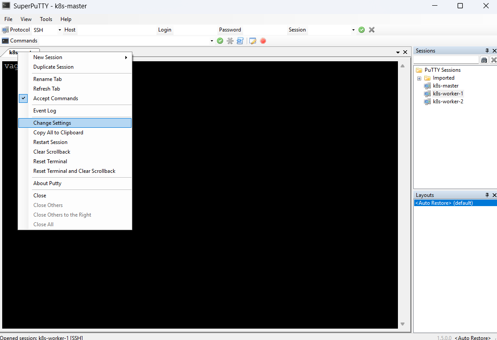

Then go to `Connection -> SSH -> Tunnels` and set up the following:
- Source port: `8081` - this is the port that you will use in browser on your Windows host machine
- Destination: `localhost:8081` - this is where the remote machine will send our traffic after receiving it through the tunnel, in our case, we want them to go to the machine itself (its own `localhost`) at port `8081`

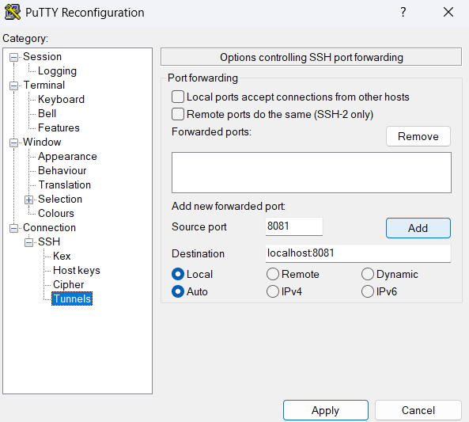

Then just click `Add`.

Now, if you go to your browser and go to:

```bash
localhost:8081
```

You should be greeted by a login page.

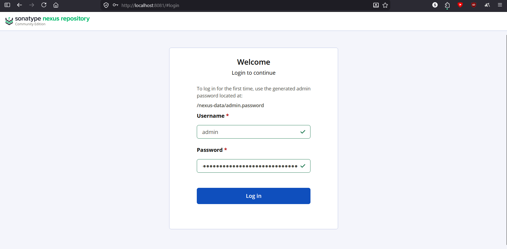

At this point, your browser is not directly connecting to the Nexus container.

Instead:
- Your browser connects to your local machine (localhost:8081)
- SSH forwards that traffic to the remote machine
- The remote machine connects to Nexus
- The response is sent back through the SSH tunnel

This is called port forwarding and is widely used in real environments to securely access internal services.

## Logging in to Nexus

You can log in using:
- Username: `admin`
- Password: `<the password obtained earlier using the provided command>`

If you need a reminder for the command to get the password:
```bash
docker exec my-nexus cat /nexus-data/admin.password
```

It should give you a string like:
```bash
d2e04c4e-e153-42c4-970d-707c7b02bbe6
```

It might come out glued to the `vagrant@k8s-master:~$` like:
```bash
d2e04c4e-e153-42c4-970d-707c7b02bbe6vagrant@k8s-master:~$
```

If this happens, you will have to do a bit of string surgery there to select it :)


After that, it will greet you with:

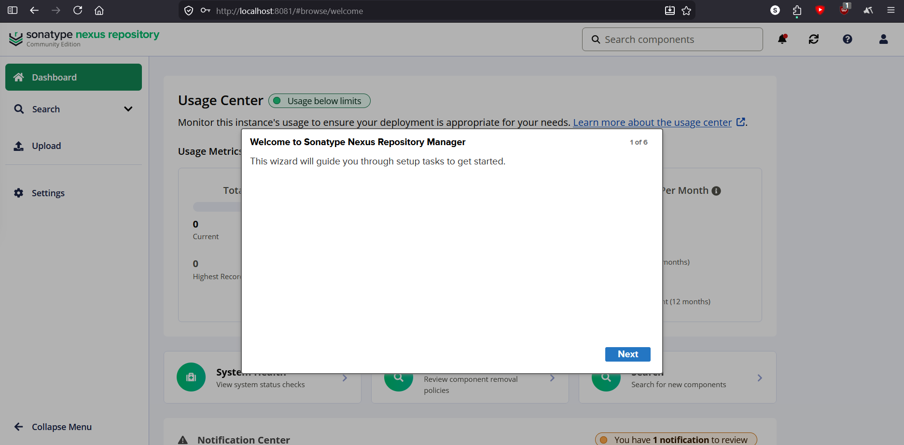

Click `Next`.

It will ask you to enter a new password. Just enter `admin123` for simplicity (password requires at least 8 characters) and click `Next`.

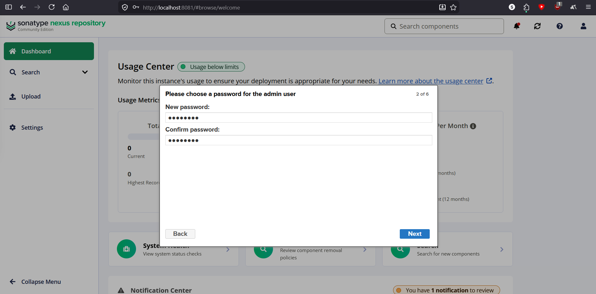

In the next screen, click `Next`

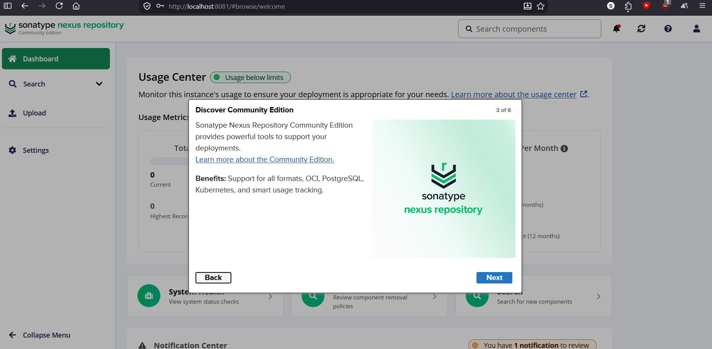

Agree to the terms (After reading them, of course :D).

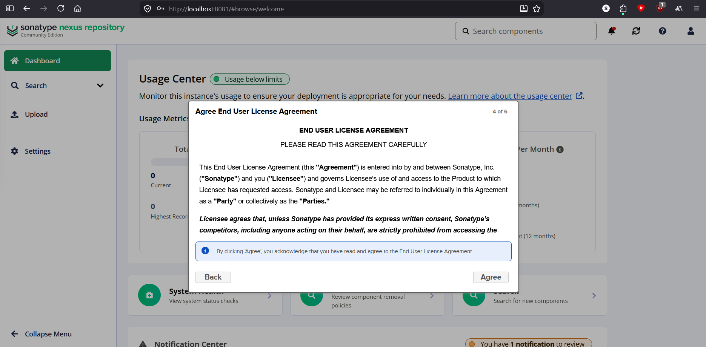

On the next one, pick `Disable anonymous access`. We will make our own user for access to our repository. Then hit `Next`.

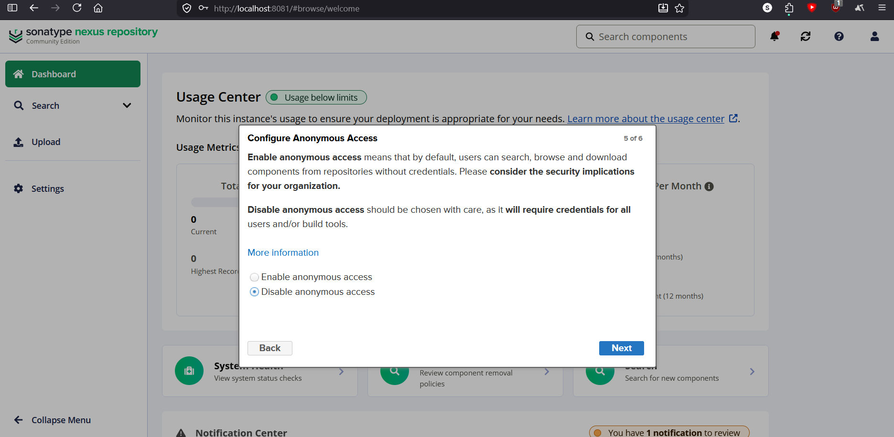

You can now click `Finish`.

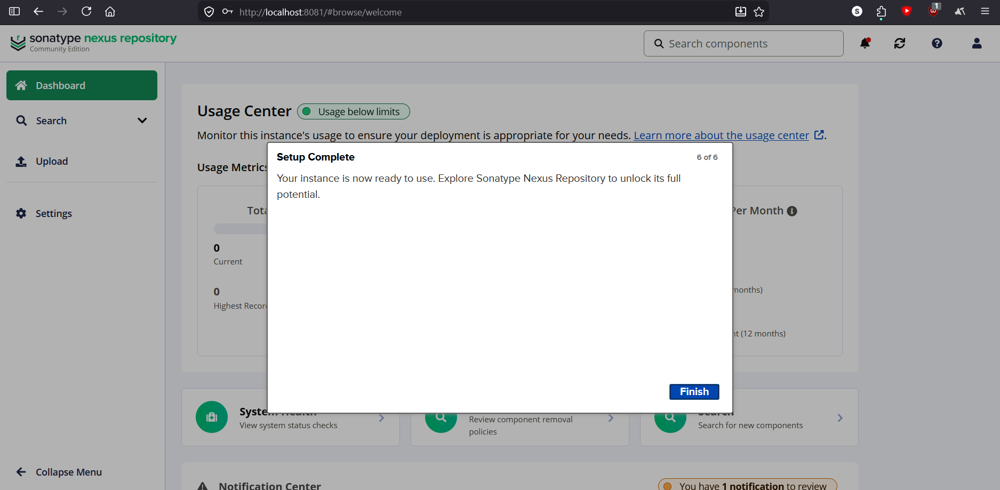

## Creating our own user

We will now create a user that we will later use to access our repository.

Now, on the main interface, click `Settings`.

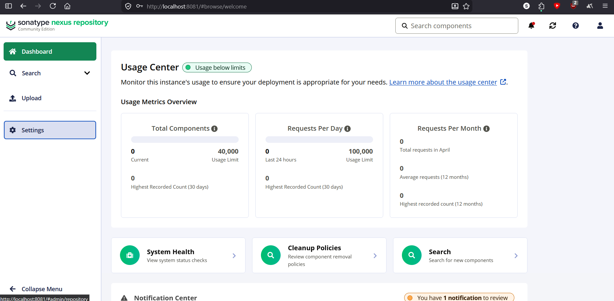

Then go to `Security -> Users` and click `Create local user`

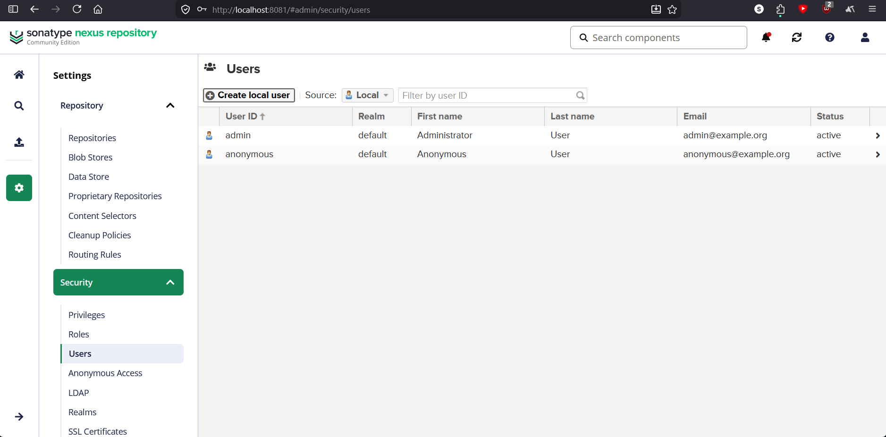

I gave it the following credentials. Feel free to use the same:
- ID: `kube-user`
- First name: `kube`
- Last name: `user`
- Email: `kube-user@example.com`
- Password: `123123123`
- Confirm Password: `123123123`
- Status: `Active`

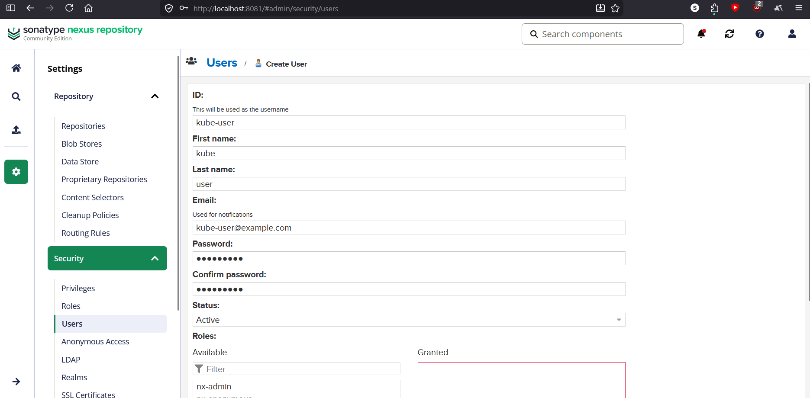

Then, for simplicity, give your user the `nx-admin` role and click `Create local user`.

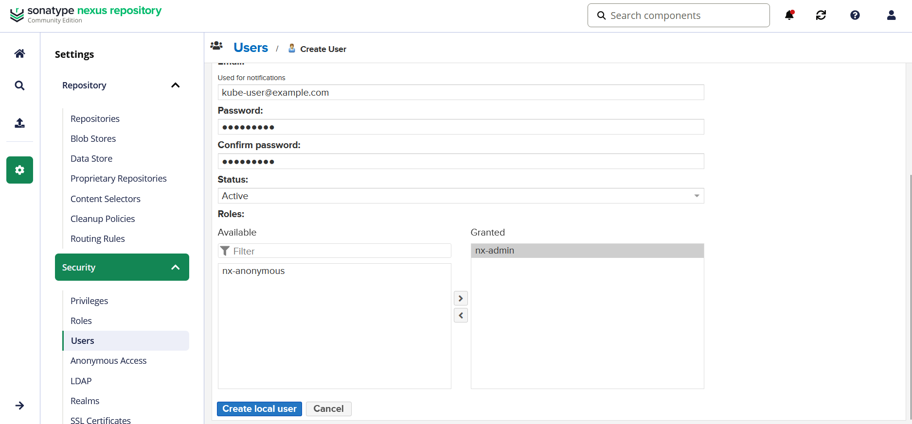

We just picked the `nx-admin` role for the sake of simplicity.

In a real scenario, we would create our own role that only gives access to our repository. This would be done after creating our repository. You would have to create a `privilege` linked to our repository which is basically a list of actions that can be taken on the repository. After that we would create a `role` that has the `privilege` we created. After that, we would assign the `role` to our `user`.

But to keep it simple, we just gave our user admin access.

## Creating an image repository

In the same settings screen, click on `Repositories` then click on `Create repository`.

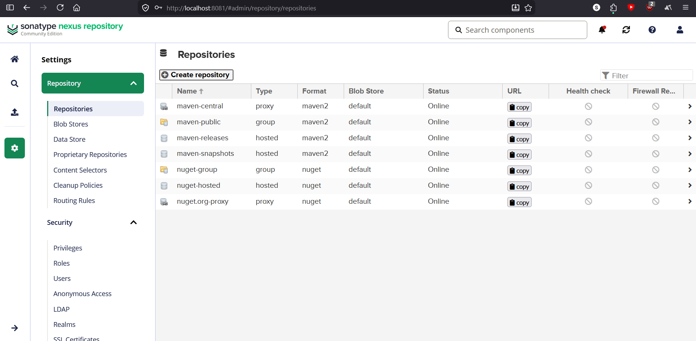

Then pick `docker (hosted)`.

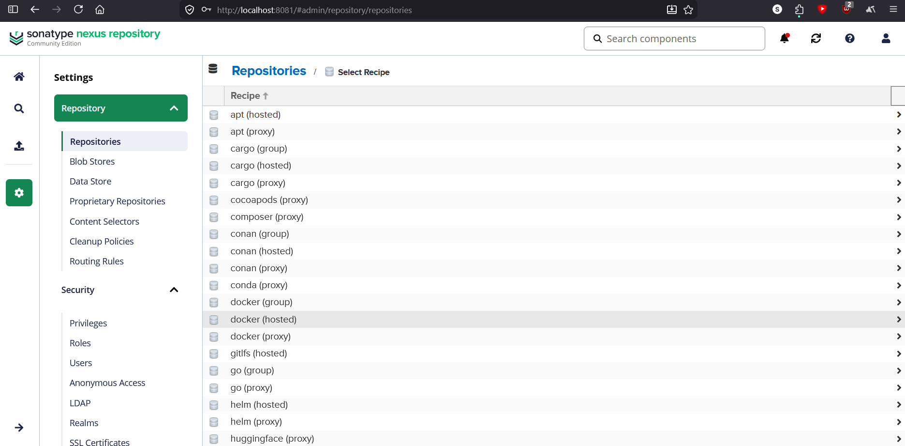

On the next screen, set the following:
- Name: `docker` (or anything you want really)
- check `Online`
- check `Other Connectors`
- check `HTTP` and specify port `8082`, the one we forwarded earlier and marked as an allowed insecure repository for our Docker daemon.

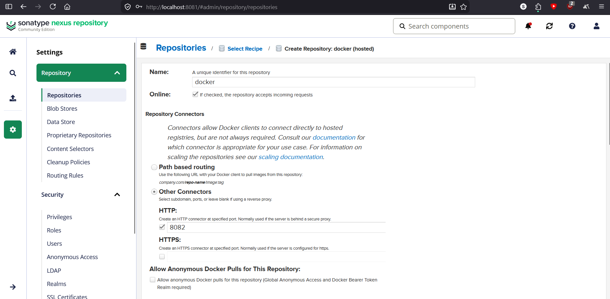

Then, scroll all the way down and click `Create repository`.

That's it. We now have our own repository. Let's test it out!

## Storing an image to our own image registry

We should already have the `nginx:1.25` image downloaded from our earlier experiments.

We can check using the `docker images` command. Its output should be something like this:

```bash
vagrant@k8s-master:~$ docker images
                                                       i Info →   U  In Use
IMAGE                    ID             DISK USAGE   CONTENT SIZE   EXTRA
hello-world:latest       452a468a4bf9       25.9kB         9.49kB    U
nginx:1.25               a484819eb602        276MB         73.9MB
sonatype/nexus3:latest   589f3ccbe281       1.07GB          439MB    U
```

In order to push the `nginx:1.25` image to our registry, we have to re-tag it.

Tagging an image simply creates another name by which we can refer to that image.

The name is important. The name can include the registry to which Docker will attempt to push the image. By default, if no registry is specified, Docker treats the image as if it were named `docker.io/library/nginx:1.25`.

Tag the `nginx:1.25` image like so:
```bash
docker tag nginx:1.25 k8s-master:8082/nginx:1.25
```

To push the image to our repository, we first have to log in to it:

```bash
docker login k8s-master:8082
```

Use the credentials of the user we created:
- username: `kube-user`
- password: `123123123`

You should get the following output:
```bash
vagrant@k8s-master:~$ docker login k8s-master:8082
Username: kube-user
Password:

WARNING! Your credentials are stored unencrypted in '/home/vagrant/.docker/config.json'.
Configure a credential helper to remove this warning. See
https://docs.docker.com/go/credential-store/

Login Succeeded
```

After this, to push the image to your repository:
```bash
docker push k8s-master:8082/nginx:1.25
```

This is the output you will get:
```bash
vagrant@k8s-master:~$ docker push k8s-master:8082/nginx:1.25
The push refers to repository [k8s-master:8082/nginx]
09f376ebb190: Pushed
a11fc495bafd: Pushed
933cc8470577: Pushed
999643392fb7: Pushed
971bb7f4fb12: Pushed
45337c09cd57: Pushed
de3b062c0af7: Pushed
1.25: digest: sha256:e688fed0b0c7513a63364959e7d389c37ac8ecac7a6c6a31455eca2f5a71ab8b size: 2295

i Info → Not all multiplatform-content is present and only the available single-platform image was pushed
         sha256:a484819eb60211f5299034ac80f6a681b06f89e65866ce91f356ed7c72af059c -> sha256:e688fed0b0c7513a63364959e7d389c37ac8ecac7a6c6a31455eca2f5a71ab8b
```

Note: That scary message with `Not all multiplatform-content...` just means that, originally, this image had multiple variants for different CPU architectures (amd64, arm64 etc.) and only the one that was downloaded (likely amd64) was pushed.

You can actually see that the image was created in the Nexus by going to `Browse` (the database looking icon on the left) then selecting `docker` (or the name you gave your repository). Your image should be there in the file system.

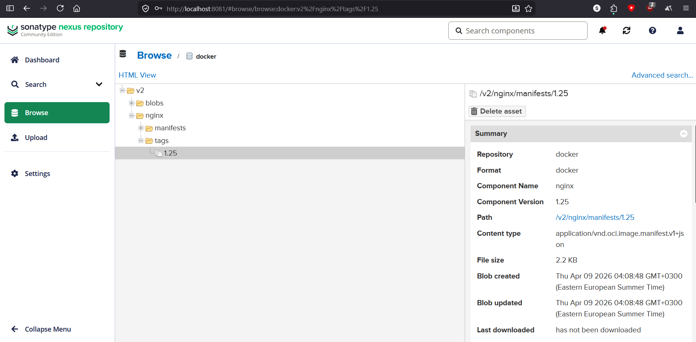

Now, we can completely delete the images from our Docker:

```bash
docker rmi nginx:1.25
docker rmi k8s-master:8082/nginx:1.25
```

We can then run a container with `nginx`, telling it to pull that image from our registry:

```bash
docker run -d --name my-nginx -p 8080:80 k8s-master:8082/nginx:1.25
```

The container will run just like earlier, except the image was pulled from our registry.

You can do `curl localhost:8080` since we mapped port 8080 to the container.

We just stored an image from Docker hub to our registry. In the next section we will create our own image based on this one.

Delete the container so that we make room for further experiments:
```bash
docker rm -f my-nginx
```

---

# Building an image using a Dockerfile

You can create your own Docker image using something called a Dockerfile.

A Dockerfile usually first specifies a starting point in the form of an image that already exists. Usually, an image that only contains basic Linux libraries and programs (but not a kernel) is used.

The Dockerfile then specifies modifications to be done on this base image. These modifications can pretty much be any Linux command or copying things from your host machine to the base image. These modifications are described using Dockerfile instructions such as RUN, COPY, or CMD.

One might wonder where those minimal images normally used as base images come from. Those use `FROM scratch` in their Dockerfiles which starts with a completely empty image. They need to provide all the Linux libraries, programs and everything required themselves (but once again, not a kernel).

In this example, we will not do such a thing. We will just take the `k8s-master:8082/nginx:1.25` image we just uploaded and modify its `index.html` so that it comes customized by default and save it under our own new tag `k8s-master:8082/nginx:1.25-custom-index`.

This means our new image is built on top of the one stored in our private registry.

A `Dockerfile` is already provided in this folder. Feel free to study it.

In order to build our image, we simply need to run:
```bash
cd /vagrant/lessons/01-docker-basics
docker build -t k8s-master:8082/nginx:1.25-custom-index .
```

The dot (`.`) specifies the build context, meaning Docker will use the current folder and its contents when building the image.

Docker automatically looks for a file named `Dockerfile` in the current directory and executes the instructions in it. If your Dockerfile has another name or is located somewhere else, you can specify it using the `-f` flag.

With `-t`, you specify what to tag the new image as.

You can also push it to your Nexus repository:
```bash
docker push k8s-master:8082/nginx:1.25-custom-index
```

You can then run it:
```bash
docker run -d --name my-nginx -p 8080:80 k8s-master:8082/nginx:1.25-custom-index
```

To test:
```bash
curl localhost:8080
```

You should get the custom `index.html` provided in the Dockerfile

Delete the container:
```bash
docker rm -f my-nginx
```

---

# OverlayFS

You might have noticed that the images have some kind of layers that they download and upload.

These layers are all generated by Dockerfile operations like RUN, COPY, ADD.

Let's simulate how these layers work.

I made three folders, `lower-1, lower-2, upper`.

If we had a Dockerfile creating these as layers, its first instruction would create `lower-1`, the second one would create `lower-2`.

After that, when we run the container, Docker creates a final writable layer called `upper` that is initially empty. That's where our changes when running the image as a container actually happen.

In our example, we will have two files in this `upper` layer just to study behavior.

You will also have to make the following folders yourself: `work, merged`

The `work` folder is a folder that the OS uses to do some operations needed for our overlay filesystem to work. We don't have to worry about it.

The `merged` folder will be the actual final filesystem that we would look at. Think of it as the filesystem you would see when you enter a running container.

OverlayFS will generate the contents of the `merged` folder based on `lower-1`, `lower-2`, and `upper`, using the `work` folder internally.

First, we need to make sure we are not in some weird filesystem area like the files Vagrant mounts:

```bash
cd ~
mkdir overlayfs-example
cd overlayfs-example
```

Then, copy the example folders from this project over and also create the `work` and `merged` folders:
```bash
cp -r /vagrant/lessons/01-docker-basics/overlayfs-example/lower-1 .
cp -r /vagrant/lessons/01-docker-basics/overlayfs-example/lower-2 .
cp -r /vagrant/lessons/01-docker-basics/overlayfs-example/upper .
mkdir work
mkdir merged
```

Now, to actually merge our layers like an image does:

```bash
sudo mount -t overlay overlay \
  -o lowerdir=lower-2:lower-1,upperdir=upper,workdir=work \
  merged
```

This command tells the system:

- use the `lower-2` and `lower-1` folders as read-only layers, `layer-2` is above `layer-1`
- use the `upper` folder as the writable layer
- use the `work` folder internally
- expose everything through the `merged` folder

You can now look inside your `merged` folder.

```bash
ls merged
```

You will see:
- lower-1.txt
- lower-2.txt
- lower-duplicate.txt
- upper-duplicate.txt
- upper.txt

You can now inspect all files.
```bash
echo "merged files:"
cat merged/lower-1.txt
cat merged/lower-2.txt
cat merged/lower-duplicate.txt
cat merged/upper-duplicate.txt
cat merged/upper.txt
```

We will get:
```bash
merged files:
---------------------------------
lower-1.txt
This came from the lower-1 layer
---------------------------------
---------------------------------
lower-2.txt
This came from the lower-2 layer
---------------------------------
---------------------------------
lower-duplicate.txt
This came from the lower-2 layer
---------------------------------
---------------------------------
upper-duplicate.txt
This came from the upper layer
---------------------------------
---------------------------------
upper.txt
This came from the upper layer
---------------------------------
```

From this information, we can see that files in higher layers hide files with the same name from lower layers.

The original files in the lower layers are never changed or removed. The lower layers are immutable.

```bash
echo "lower-1 files:"
cat lower-1/lower-1.txt
cat lower-1/lower-duplicate.txt
echo "lower-2 files:"
cat lower-2/lower-2.txt
cat lower-2/lower-duplicate.txt
cat lower-2/upper-duplicate.txt
echo "upper files:"
cat upper/upper-duplicate.txt
cat upper/upper.txt
```

Output:

```
lower-1 files:
---------------------------------
lower-1.txt
This came from the lower-1 layer
---------------------------------
---------------------------------
lower-duplicate.txt
This came from the lower-1 layer
---------------------------------
lower-2 files:
---------------------------------
lower-2.txt
This came from the lower-2 layer
---------------------------------
---------------------------------
lower-duplicate.txt
This came from the lower-2 layer
---------------------------------
---------------------------------
upper-duplicate.txt
This came from the lower-2 layer
---------------------------------
upper files:
---------------------------------
upper-duplicate.txt
This came from the upper layer
---------------------------------
---------------------------------
upper.txt
This came from the upper layer
---------------------------------
```


If we delete a file from our merged folder, the file does not actually get deleted from the layer it came from. A special marker file is created in the upper layer with the original file name to indicate that the file should be hidden. The overlay file system will then know to not display that file in the final merged version.

```bash
rm merged/lower-1.txt
```

If we now look at the merged folder, the file we deleted is no longer there:

```bash
vagrant@k8s-master:~/overlayfs-example$ ls merged
lower-2.txt  lower-duplicate.txt  upper-duplicate.txt  upper.txt
```

But in the `lower-1` layer, it's still there:

```bash
vagrant@k8s-master:~/overlayfs-example$ ls lower-1
lower-1.txt  lower-duplicate.txt
```

We can look in the `upper` layer and see the whiteout file that was created to tell the overlay filesystem that the lower-1.txt file should be considered deleted:

```bash
vagrant@k8s-master:~/overlayfs-example$ ls -la upper
total 16
drwxrwxr-x 2 vagrant vagrant 4096 Apr 15 08:06 .
drwxrwxr-x 7 vagrant vagrant 4096 Apr 15 07:25 ..
c--------- 2 root    root    0, 0 Apr 15 08:06 lower-1.txt
-rwxrwxr-x 1 vagrant vagrant  123 Apr 15 07:25 upper-duplicate.txt
-rwxrwxr-x 1 vagrant vagrant  113 Apr 15 07:25 upper.txt
```

We can see a `lower-1.txt` file that is marked as a `character special file`.

That is the whiteout file that marks `lower-1.txt` as deleted.

So even though the file looks deleted from the container's perspective, it still exists in the original layer.

Let's also try editing a file. Let's edit `lower-2.txt`.

```bash
sed -i 's/This came from the lower-2 layer/This was edited in the merged folder/' merged/lower-2.txt
```

Let's look at it in the `merged` folder:

```bash
cat merged/lower-2.txt
```

It will now be edited.

```bash
vagrant@k8s-master:~/overlayfs-example$ cat merged/lower-2.txt
---------------------------------
lower-2.txt
This was edited in the merged folder
---------------------------------
```

Let's check what it looks like in its original layer:

```bash
cat lower-2/lower-2.txt
```

It will still be the original file:

```bash
vagrant@k8s-master:~/overlayfs-example$ cat lower-2/lower-2.txt
---------------------------------
lower-2.txt
This came from the lower-2 layer
---------------------------------
```

So, where is it edited?

When editing a file that originated from a lower layer, a copy of the file will be made in the upper layer and that copy will be the one being edited. 

This mechanism is called copy-on-write: instead of modifying the original file, a copy is created in the upper layer and modified there.

We can see the copied and edited file in the `upper` layer:

```bash
ls -la upper
```

Output:

```bash
vagrant@k8s-master:~/overlayfs-example$ ls -la upper
total 20
drwxrwxr-x 2 vagrant vagrant 4096 Apr 15 08:19 .
drwxrwxr-x 7 vagrant vagrant 4096 Apr 15 07:25 ..
c--------- 2 root    root    0, 0 Apr 15 08:06 lower-1.txt
-rwxrwxr-x 1 vagrant vagrant  121 Apr 15 08:19 lower-2.txt
-rwxrwxr-x 1 vagrant vagrant  123 Apr 15 07:25 upper-duplicate.txt
-rwxrwxr-x 1 vagrant vagrant  113 Apr 15 07:25 upper.txt
```

We can see a `lower-2.txt` file. If we open it:

```bash
cat upper/lower-2.txt
```

Output:

```bash
vagrant@k8s-master:~/overlayfs-example$ cat upper/lower-2.txt
---------------------------------
lower-2.txt
This was edited in the merged folder
---------------------------------
```


To unmount the overlay filesystem:
```bash
sudo umount merged
```

This is exactly how Docker images and containers work.

Image layers are read-only, and when a container runs, it adds a writable layer on top where all changes are stored.

In our dockerfiles, we never modify existing layers we only add changes on top.

# Builder images

Because of the OverlayFS behavior described in the previous section, if our Dockerfile deletes a file from an image, that file actually still exists in the previous layers, taking up space.

Instead, a special marker file (called a whiteout file) is added in the layer created by the delete instruction.

Why are container images built like this?

Because layers are immutable and reusable.

If some of the layers of two different images are identical, which Docker checks in their contents by comparing their hashes, Docker will not store them twice.

Instead, it stores those layers only once and reuses them across multiple images.

This makes images more efficient in terms of storage and also speeds up builds and downloads.

Docker can reuse cached layers during builds, making rebuilds faster.

It also only downloads the layers that it doesn't already have.

When running a container, Docker stacks all of the image layers in order and adds a final writable layer on top, just like we saw in the OverlayFS example.

A common situation is when we copy something large, like a zip file, into an image, then delete it after unzipping.

Even if deleted, the zip file would still exist in the layer where it was copied, adding to the size of the image.

This can be avoided by using a builder image.

We can copy our zip file into a separate build stage, unzip it there, and then start from a fresh image and copy only the unzipped contents.

The builder image is then simply discarded.

Because the final image starts from a fresh base image, the large file never exists in its layers.

We will look at such an example now.

We have 2 Dockerfiles. One has a builder, one doesn't.

Both of them generate a 50 MB file using random data, then delete it and then create a text file.

The one that uses a builder stage then copies the text file to a fresh image.

The images generated by both processes are functionally identical.

Let's build both and then compare their sizes:

```bash
cd /vagrant/lessons/01-docker-basics/overlayfs-example
docker build -f Dockerfile-builder -t overlayfs-example:builder .
docker build -f Dockerfile-no-builder -t overlayfs-example:no-builder .
```

You can then check the sizes of the images:
```bash
docker images | grep overlayfs-example
```

You will be able to see that the image with no builder is bigger, even though both images contain the same final files, the one without a builder is larger because the 50MB file still exists in one of its layers:

```bash
vagrant@k8s-master:/vagrant/lessons/01-docker-basics/overlayfs-example$ docker images | grep overlayfs-example
WARNING: This output is designed for human readability. For machine-readable output, please use --format.
overlayfs-example:builder                 5aa4fba1ea31       12.1MB         3.63MB
overlayfs-example:no-builder              5df68f2455fa        117MB         56.1MB
```

You can even see the layers by using the `docker history` command.

The image with a builder:

```bash
docker history overlayfs-example:builder
```

Output:

```bash
vagrant@k8s-master:/vagrant/lessons/01-docker-basics/overlayfs-example$ docker history overlayfs-example:builder
IMAGE          CREATED         CREATED BY                                      SIZE      COMMENT
5aa4fba1ea31   7 minutes ago   CMD ["sh"]                                      0B        buildkit.dockerfile.v0
<missing>      7 minutes ago   COPY /app/small.txt . # buildkit                12.3kB    buildkit.dockerfile.v0
<missing>      7 minutes ago   WORKDIR /app                                    8.19kB    buildkit.dockerfile.v0
<missing>      2 months ago    CMD ["/bin/sh"]                                 0B        buildkit.dockerfile.v0
<missing>      2 months ago    ADD alpine-minirootfs-3.20.9-x86_64.tar.gz /…   8.47MB    buildkit.dockerfile.v0
```

The image without a builder:

```bash
docker history overlayfs-example:no-builder
```

Output:

```bash
vagrant@k8s-master:/vagrant/lessons/01-docker-basics/overlayfs-example$ docker history overlayfs-example:no-builder
IMAGE          CREATED         CREATED BY                                      SIZE      COMMENT
5df68f2455fa   8 minutes ago   CMD ["sh"]                                      0B        buildkit.dockerfile.v0
<missing>      8 minutes ago   RUN /bin/sh -c echo "hello" > small.txt # bu…   12.3kB    buildkit.dockerfile.v0
<missing>      8 minutes ago   RUN /bin/sh -c rm bigfile.bin # buildkit        8.19kB    buildkit.dockerfile.v0
<missing>      8 minutes ago   RUN /bin/sh -c dd if=/dev/urandom of=bigfile…   52.4MB    buildkit.dockerfile.v0
<missing>      8 minutes ago   WORKDIR /app                                    8.19kB    buildkit.dockerfile.v0
<missing>      2 months ago    CMD ["/bin/sh"]                                 0B        buildkit.dockerfile.v0
<missing>      2 months ago    ADD alpine-minirootfs-3.20.9-x86_64.tar.gz /…   8.47MB    buildkit.dockerfile.v0
```

You can actually see the 50MB layer right there.

Deleting files in a Dockerfile does not reduce image size. Avoiding adding them in the first place does

---

# CGroups

Containers can have their resource usage limited by something called control groups or CGroups.

CGroups are a Linux feature that allows the system to limit and track resource usage for processes.

This is pretty simple to showcase.

I will show an example where I limit the CPU usage of a process, using CGroups.

I will use the `yes` command which simply spams "y" in the console output, as fast as possible.

In a separate shell on the same machine, we can run `htop`, press F6 and use the arrow keys to select PERCENT_CPU to list the processes by that.

When running `yes` without limiting it, the yes process will jump to 100% CPU.

100% here means fully using one CPU core.

To run it in a limited way, we can run it like so:

```bash
sudo systemd-run --scope -p CPUQuota=20% yes
```

Now it will only be allowed to use 20% of a single CPU core.

Docker uses CGroups under the hood to enforce resource limits on containers.

There are similar ways to restrict RAM usage, for example by setting memory limits when running containers.

---

That is it for the Docker section. Next up, we will do a deep dive into how Docker and even Kubernetes does this networking between containers in the background. This will also explain the final piece of how containers work.

---

# [02 - Networking Deep Dive](../02-networking-deep-dive/README.md)
