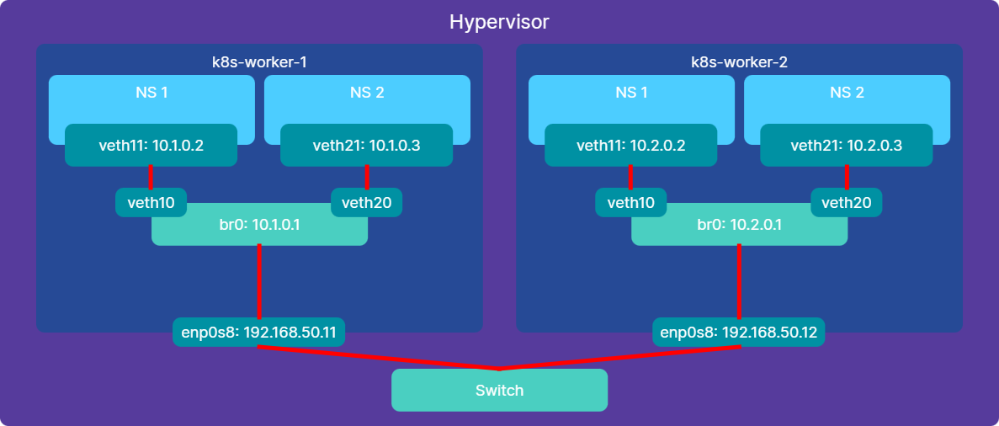
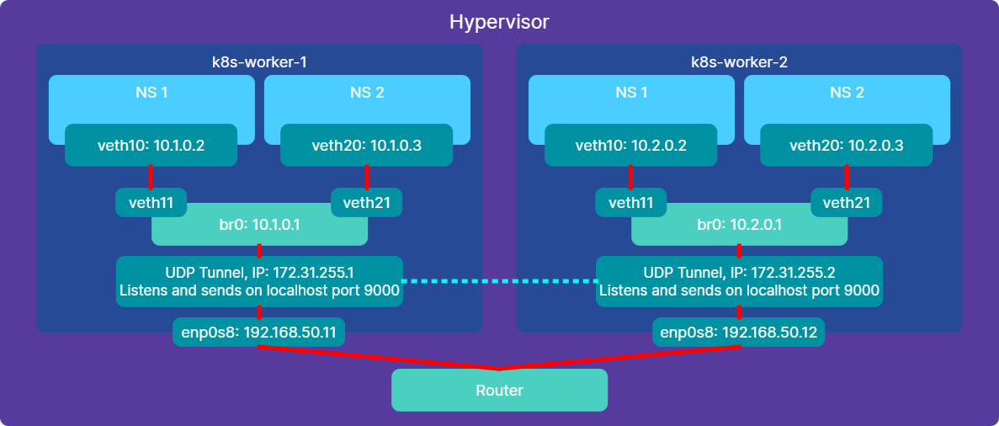

[← Back to Lessons](../../README.md#lessons)

# Networking Deep Dive: How Containers Talk Across Machines

# Table of contents

- [The reasoning behind this lesson](#the-reasoning-behind-this-lesson)
- [Simulating how Kubernetes networking works between containers](#simulating-how-kubernetes-networking-works-between-containers)
- [Simulating Kubernetes networking between machines on the same network](#simulating-kubernetes-networking-between-machines-on-the-same-network)
- [Simulating Kubernetes networking between machines on different networks](#simulating-kubernetes-networking-between-machines-on-different-networks)
  - [Overlay network setup steps](#step-1)
- [Final words on this topic](#final-words-on-this-topic)

---

# The reasoning behind this lesson

In the previous lesson, we learned how containers run and behave on a single machine.

However, real systems rarely run on just one machine. We need containers to communicate:
- with each other on the same machine
- across multiple machines

While Docker allows us to run containers locally, scaling across machines quickly becomes complex:
- installing Docker everywhere
- configuring networking manually
- managing connectivity between nodes

Kubernetes solves this problem by making a cluster of machines behave like a single system.

In this lesson, we will manually build what Kubernetes does automatically, so we can understand what happens behind the scenes.

This will make Kubernetes networking concepts much easier to understand later.

---

# Simulating how Kubernetes networking works between containers

Scripts that help us create such a simulation have been provided in the `scripts` folder of this lesson.

In order to simulate containers, we will use a Linux feature called **network namespaces**.

These allow us to create isolated network environments that behave like independent machines.

Later, we will see that Kubernetes `Pods` are built on top of this concept.

We will study two situations. One where the host machines are on the same local network and one where the host machines are on completely different networks.

We will use our `k8s-worker-1` and `k8s-worker-2` machines for these purposes.

---

## Simulating Kubernetes networking between machines on the same network

Our goal is to get such a setup:



In this setup, we simulate containers by making network namespaces on our `k8s-worker-1` and `k8s-worker-2` nodes.

Scripts are provided to create such a setup.

Feel free to study the scripts. Plenty of comments are provided inside them.

They are thoroughly explained in the course accompanying this repo.

Also, they check which environment you're trying to run them on so you don't accidentally run them on the wrong one.

On `k8s-worker-1`, run:
```bash
/vagrant/lessons/02-networking-deep-dive/scripts/k8s-worker-1.sh
```

On `k8s-worker-2`, run:
```bash
/vagrant/lessons/02-networking-deep-dive/scripts/k8s-worker-2.sh
```

If you have problems running the scripts due to permissions, run the following on both machines:
```bash
sudo chmod +x /vagrant/lessons/02-networking-deep-dive/scripts/*
```

We can now use the following command to run any command as if we were on a separate computer inside that namespace:

```bash
sudo ip netns exec $NS1 <your command>
```

Scripts were provided to test the connectivity.

On `k8s-worker-1`, run:
```bash
/vagrant/lessons/02-networking-deep-dive/scripts/k8s-worker-1-tests.sh
```

On `k8s-worker-2`, run:
```bash
/vagrant/lessons/02-networking-deep-dive/scripts/k8s-worker-2-tests.sh
```

You can run individual parts of the setup or test scripts by first exporting all variables at the top of the scripts (just copy that whole segment and run it before running anything else).

In this example, the bridge acts like a switch between the two namespaces of the same machine, but acts like a router for getting traffic from a namespace towards the outside.

The hypervisor itself acts as a switch between the two machines (`k8s-worker-1` and `k8s-worker-2`).

In order to clean up the environment:
On `k8s-worker-1`, run:
```bash
/vagrant/lessons/02-networking-deep-dive/scripts/k8s-worker-1-cleanup.sh
```

On `k8s-worker-2`, run:
```bash
/vagrant/lessons/02-networking-deep-dive/scripts/k8s-worker-2-cleanup.sh
```

Please, run the scripts to clean up your environment in preparation for the next section.

---

## Simulating Kubernetes networking between machines on different networks

We saw how Kubernetes can set up container networking between machines that are on the same network.

However, machines in a Kubernetes cluster do not need to be on the same local network. As long as they can reach each other over the internet, they can be located anywhere.

### To make this work, Kubernetes often uses a different approach called an **overlay network**.



For our purposes, we will pretend that our two machines are not on the same network. The fact that they actually are does not change how the setup works.

An overlay network connects machines using something called a **tunnel**.

A tunnel is made up of two programs:
- one running on `k8s-worker-1`
- one running on `k8s-worker-2`

These two programs communicate with each other over the network.

We will refer to them as:
- `tunnel-1` on `k8s-worker-1`
- `tunnel-2` on `k8s-worker-2`

When traffic is sent to `tunnel-1`, it does not forward it directly.

Instead, it **wraps the original packet inside another packet** (this is called *encapsulation*) and sends it to `tunnel-2`.

`tunnel-2` then **unwraps the packet** (*decapsulation*) and forwards it inside `k8s-worker-2` as if it had arrived locally.

From there, the packet continues toward its destination using the normal routing rules on `k8s-worker-2`.

The response is generated normally by the destination using the original source IP of the packet.

This is possible because the tunnel preserves the original packet. It only wraps it, without modifying it.

On `k8s-worker-2`, routing rules ensure that traffic destined for IP addresses on `k8s-worker-1` is sent through the tunnel.

`tunnel-2` then encapsulates the response and sends it back to `tunnel-1`, which decapsulates it and delivers it to the original sender.

This means that from the perspective of the containers, communication works exactly as if they were on the same network.

In reality, the machines are not on the same network. The tunnel creates the illusion of a shared network by transporting packets between them.

The tunnel hides the complexity of the underlying network while preserving the original packet.

This is what makes overlay networks powerful: they let us design our own network on top of an existing one.

### Step 1

First of all, on both `k8s-worker-1` and `k8s-worker-2`, run the following to install the application we will use to run the tunnel:

```bash
sudo apt install socat
```

If it shows you some scary looking screens talking about rebooting your system to load a new kernel or other things, press enter on them.

Now, to set everything up:

### Step 2

On `k8s-worker-1`, run:
```bash
/vagrant/lessons/02-networking-deep-dive/scripts/k8s-worker-1-overlay.sh
```

### Step 3

On `k8s-worker-2`, run:
```bash
/vagrant/lessons/02-networking-deep-dive/scripts/k8s-worker-2-overlay.sh
```

### Step 4

Then, on `k8s-worker-1` run:
```bash
sudo socat UDP:192.168.50.12:9000,bind=192.168.50.11:9000 TUN:172.31.255.1/30,tun-name=tundudp,iff-no-pi,tun-type=tun &
```

This starts the **tunnel** process on `k8s-worker-1`. The process also creates a `tunnel` device type that will be called `tundudp` as we specified. This device will be turned off to start with.

If we choose to turn it on by default, the `socat` command will attempt to use the tunnel immediately before the peer is ready, which causes it to fail.

### Step 5

Then, on `k8s-worker-2` run:
```bash
sudo socat UDP:192.168.50.11:9000,bind=192.168.50.12:9000 TUN:172.31.255.2/30,tun-name=tundudp,iff-no-pi,tun-type=tun,iff-up &
sudo ip route add 10.1.0.0/24 via 172.31.255.1 dev tundudp
```

This starts the **tunnel** process on `k8s-worker-2`. The `tundudp` interface on this machine is brought up because we specified `iff-up`.

This works because the `socat` process on `k8s-worker-1` is already running and listening, even if its `tundudp` interface is still down.

The `socat` command does not require the `tundudp` interface to be up on the other end, but it does require the peer `socat` process to be listening when it attempts to bring its own `tundudp` interface up.

If the peer is not listening, the command fails because it cannot establish the tunnel.

The second command tells the `k8s-worker-2` host machine to forward any traffic meant for the subnet of the namespaces on `k8s-worker-1` through the `tundudp` device on `k8s-worker-2`.

### Step 6

Then, come back to `k8s-worker-1` and run:
```bash
sudo ip link set dev tundudp up
sudo ip route add 10.2.0.0/24 via 172.31.255.2 dev tundudp
```

At this point, the tunnel forms its own small network between the two machines.

- `172.31.255.1` exists on `k8s-worker-1`
- `172.31.255.2` exists on `k8s-worker-2`

Each machine treats the other as a reachable neighbor on this network, just like two machines connected by a direct cable. This is exactly how routing works: traffic is sent to the next hop (a known neighbor), not directly to the final destination.

The first command finally turns on `tundudp` on `k8s-worker-1`.

The second command tells the `k8s-worker-1` host machine to forward any traffic meant for the subnet of the namespaces on `k8s-worker-2` through the `tundudp` device on `k8s-worker-1`.

You should be good to go. You can now run the same tests as earlier. The traffic will now go through the tunnel.

You can verify that the tunnel is working by pinging the tunnel IPs directly:

On `k8s-worker-1`:
```bash
ping 172.31.255.2
```

On `k8s-worker-2`:
```bash
ping 172.31.255.1
```

Each machine treats the other as a reachable neighbor. This is why we use `via` in the routing rules: we are explicitly telling the kernel which next hop to use to reach the remote subnet that the namespaces on the other machine are in.

Note that the Tunnel's "ends" (the `tundudp` devices) act as if they are network interfaces on their own network, with the IP addresses `172.31.255.1` and `172.31.255.2`. In reality, the `socat` processes send the encapsulated traffic over the normal network between the machines, to the IPs of the `k8s-worker-1` or the `k8s-worker-2` machines.

From the perspective of the operating system, the `tundudp` interfaces behave as if there were a direct network cable connecting the two machines.

In order to run the full test scripts:

On `k8s-worker-1`, run:
```bash
/vagrant/lessons/02-networking-deep-dive/scripts/k8s-worker-1-tests.sh
```

On `k8s-worker-2`, run:
```bash
/vagrant/lessons/02-networking-deep-dive/scripts/k8s-worker-2-tests.sh
```

If you would like to confirm that traffic is actually going through the tunnel, you can turn off the `tundudp` device on `k8s-worker-1`:

```bash
sudo ip link set dev tundudp down
```

And then re-run the test script there. The tests meant for the namespaces on the `k8s-worker-2` machine should now fail.


In order to clean up the environment:
On `k8s-worker-1`, run:
```bash
/vagrant/lessons/02-networking-deep-dive/scripts/k8s-worker-1-cleanup.sh
```

On `k8s-worker-2`, run:
```bash
/vagrant/lessons/02-networking-deep-dive/scripts/k8s-worker-2-cleanup.sh
```

Please, clean it up when done experimenting so that we don't run into new and never-encountered-before problems when playing with Kubernetes :)

## Final words on this topic

This is conceptually similar to how Kubernetes networking solutions called Container Network Interface (CNI) plugins connect pods (containers inside such namespaces) across nodes (machines on which the containers run), abstracting away the underlying network complexity while preserving direct pod-to-pod communication.

We will talk about these in further lessons, but the knowledge from this lesson will make it way easier to understand the concepts.

Next up, we will finally install Kubernetes and start playing with it.

---

## [03 - Kubernetes Installation](../03-kubernetes-installation/README.md)  
